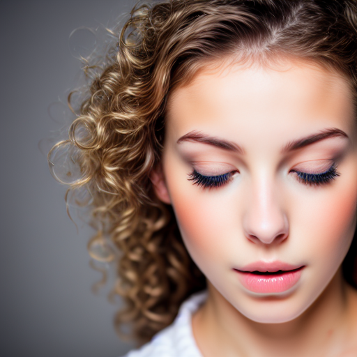
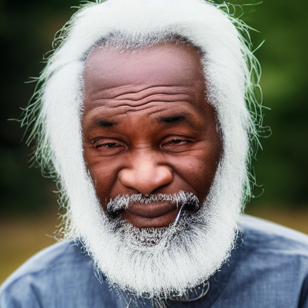
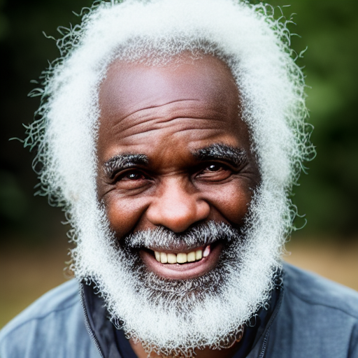

<div align="center">

# Diffusion-NPO: Negative Preference Optimization for Better Preference Aligned Generation of Diffusion Models


By Fu-Yun Wang¹, Yunhao Shui², Jingtan Piao¹, Keqiang Sun¹, Hongsheng Li¹
<br>
¹CUHK-MMLab ²Shanghai Jiao Tong University


[](https://arxiv.org/abs/XXXX.XXXXX) [](LICENSE)

</div>

## Overview

This repository contains the official implementation for **Diffusion-NPO: Negative Preference Optimization for Better Preference Aligned Generation of Diffusion Models**, our paper accepted at ICLR 2025.

Diffusion-NPO introduces **Negative Preference Optimization (NPO)**, a novel plug-and-play approach to enhance the alignment of diffusion models with human preferences. By training a model to understand and avoid undesirable outputs, NPO improves the effectiveness of classifier-free guidance (CFG) in diffusion models, leading to superior image and video generation quality.

## Key Features

* Enhanced Preference Alignment: Improves high-frequency details, color, lighting, and low-frequency structures in generated images and videos.
* Plug-and-Play: Seamlessly integrates with models like Stable Diffusion (SD1.5, SDXL), VideoCrafter2, and their preference-optimized variants (Dreamshaper, Juggernaut).
* No New Data or Strategies Required: Adapts existing preference optimization methods (e.g., DPO, RL, Differentiable Reward) with minimal modifications.
* Comprehensive Validation: Demonstrated effectiveness across text-to-image and text-to-video tasks using metrics like PickScore, HPSv2, ImageReward, and LAION-Aesthetic.

## Installation

### Prerequisites

* Python 3.+
* PyTorch 1.13+
* CUDA 11.6+ (for GPU support)
* Dependencies listed in env.yml

### Setup

1.  Clone the repository:
    ```bash
    git clone [https://github.com/G-U-N/Diffusion-NPO.git](https://github.com/G-U-N/Diffusion-NPO.git)
    cd Diffusion-NPO
    ```
2.  Install dependencies:
    ```bash
    conda env create -f env.yml
    conda activate npo
    ```
3.  Download pre-trained model weights (e.g., Stable Diffusion v1-5, SDXL) and place them in the `models/` directory. Links to official weights are provided in the [Model Zoo](#model-zoo).

## Usage

### Training

To train an NPO model, use the provided training scripts. For example, to train NPO with Diffusion-DPO on Stable Diffusion v1-5:

> Naively, it is just one line code modification of the original dpo training script. see line 688 of train_dpo_bad.py

```bash
accelerate launch --main_process_port 29501 train_dpo_bad.py \
  --pretrained_model_name_or_path=/mnt2/wangfuyun/models/stable-diffusion-v1-5 \
  --output_dir="real-outputs/diffusion-dpo-bad-beta500" \
  --mixed_precision="fp16" \
  --dataset_name=yuvalkirstain/pickapic_v1 \
  --resolution=512 \
  --train_batch_size=64 \
  --gradient_accumulation_steps=1 \
  --gradient_checkpointing \
  --use_8bit_adam \
  --rank=8 \
  --beta_dpo=500 \
  --learning_rate=5e-6 \
  --report_to="tensorboard" \
  --lr_scheduler="constant" \
  --lr_warmup_steps=0 \
  --enable_xformers_memory_efficient_attention \
  --max_train_steps=5000 \
  --checkpointing_steps=1000 \
  --tracker_name="diffusion-dpo-bad" \
  --run_validation --validation_steps=500 \
  --seed=0 \
  2>&1 | tee -a diffusion-dpo-real-sd-beta500.log
````

Key arguments:

  * `--pretrained_model_name_or_path`: Path to the pre-trained diffusion model.
  * `--train_batch_size`: Training batch size.
  * `--dataset_name`: Which dataset is used for training.
  * `--beta_dpo`: Regularization factor for controlling deviation (default: 500).

### Inference

Inference with SDXL, just run the gen\_xl.sh

```bash
python gen_xl.py --generation_path="results/sdxl_cfg5/origin/"  --merge_weight=0.0  --cfg=5

python gen_xl.py --generation_path="results/sdxl_cfg5/origin+npo/" --npo_lora_path="weights/sdxl/sdxl_beta2k_2kiter.safetensors" --merge_weight=0.0  --cfg=5

python gen_xl.py --generation_path="results/sdxl_cfg5/dpo/"  --merge_weight=0.0  --cfg=5

python gen_xl.py --generation_path="results/sdxl_cfg5/dpo+npo/" --npo_lora_path="weights/sdxl/sdxl_beta2k_2kiter.safetensors" --merge_weight=0.0  --cfg=5
```

Key arguments:

  * `--generation_path`: which positive model to use.
  * `--cfg`: CFG values.
  * `--npo_lora_path`: Which npo weight to use.
  * `--merge_weight`: the beta parameters discussed in the paper.

## Example Outputs

Below are example comparisons of generations with and without NPO:


| Prompt | w/o NPO | w/ NPO |
|--------|---------|--------|
| "an attractive young woman rolling her eyes" |  |  |
| "Black old man with white hair" |  |  |

## Model Zoo

Pre-trained NPO weight offsets are available for the following models:
- Stable Diffusion v1-5: [Download](https://huggingface.co/G-U-N/diffusion-npo/sd15_npo)
- Stable Diffusion XL: [Download](https://huggingface.co/G-U-N/diffusion-npo/sdxl_npo)
- DreamShaper: [Download](https://huggingface.co/G-U-N/diffusion-npo/dreamshaper_npo)
- VideoCrafter2: [Download](https://huggingface.co/G-U-N/diffusion-npo/videocrafter2_npo)

Base model weights can be obtained from:
- [Stable Diffusion v1-5](https://huggingface.co/stabilityai/stable-diffusion-v1-5)
- [Stable Diffusion XL](https://huggingface.co/stabilityai/stable-diffusion-xl-base-1.0)
- [DreamShaper](https://huggingface.co/Lykon/DreamShaper)
- [VideoCrafter2](https://huggingface.co/VideoCrafter/VideoCrafter2)


## Evaluation

To evaluate NPO performance:

```bash
python compare_ratio.py
```

Before running this script, you should specify the folders to compare `[Folder 1]` and `[Folder 2]`. Please specify the folders in the code:

```python
if __name__ == "__main__":
    folder_pairs = [
        ("[FOLDER 1][ADD the FOLDER PATH HERE]", "[FOLDER 2][ADD the FOLDER PATH HERE]"),
    ]
    for folder_path1, folder_path2 in folder_pairs:
        print(folder_path1)
        print(folder_path2)
        main(folder_path1, folder_path2)
```

## Citation

If you find this work useful, please cite our paper:

```bibtex
@inproceedings{
wang2025diffusionnpo,
title={Diffusion-{NPO}: Negative Preference Optimization for Better Preference Aligned Generation of Diffusion Models},
author={Fu-Yun Wang and Yunhao Shui and Jingtan Piao and Keqiang Sun and Hongsheng Li},
booktitle={The Thirteenth International Conference on Learning Representations},
year={2025},
url={https://openreview.net/forum?id=iJi7nz5Cxc}
}
```

## License

This project is licensed under the Apache License, Version 2.0. See the [LICENSE]() file for details.

## Contact

For questions or issues, please open an issue on GitHub or contact:

Fu-Yun Wang: fywang@link.cuhk.edu.hk

